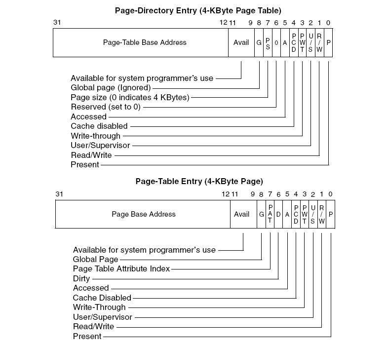
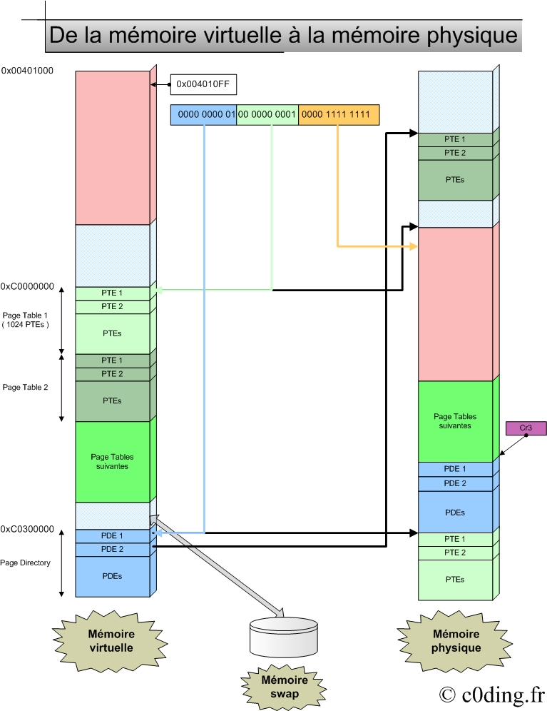
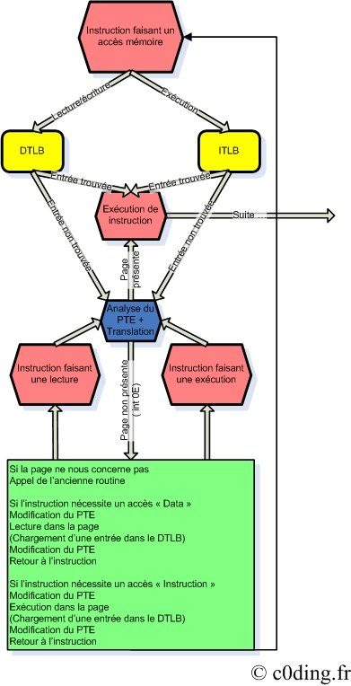
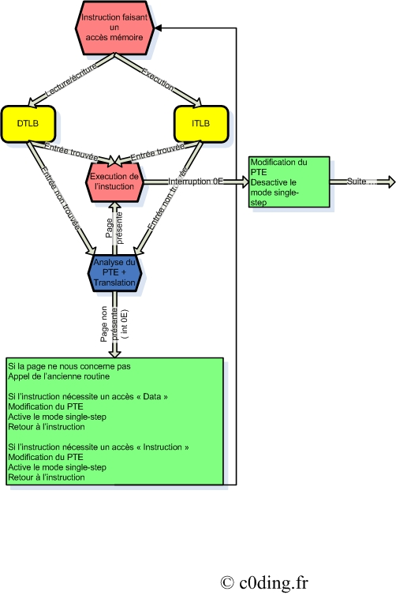
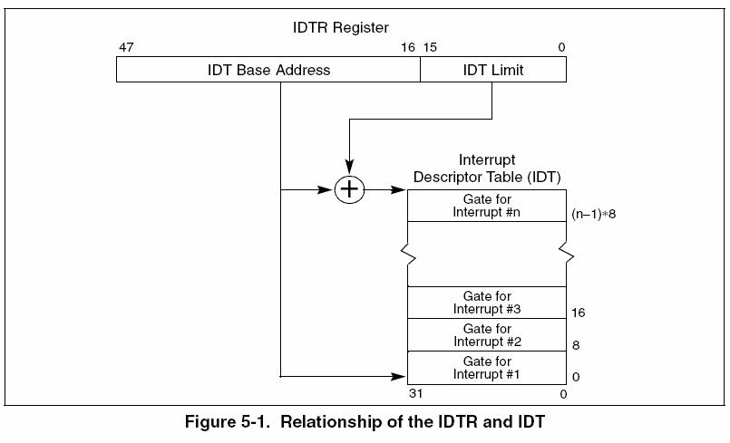
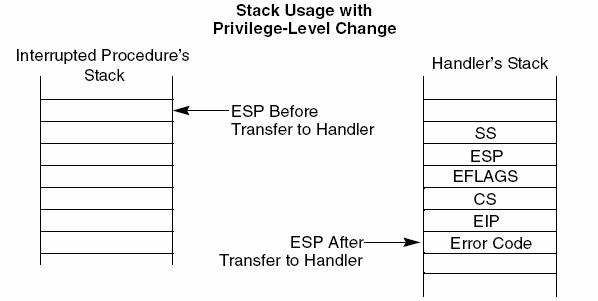

# De la réalité à la virtualité #

Alors pilule rouge ou pilule bleue ?  

Non désole cette article ne va pas parler de cette trilogie où ils ont utilisé Nmap. A ce jour on ne sait toujours pas pourquoi d’ailleurs ?

La virtualité, une chose tant convoité par l’humain. Il n’y a qu’à regarder l’essor que connais les MMORPG depuis quelques temps pour comprendre qu’une vie virtuelle est tellement réjouissante pour le moral humain.  
« Rêve ta vie en couleur, c’est le secret du bonheur. » Peter Pan connaissait t-il déjà les vies virtuelles ?  
Les statisticiens ( pour une fois qu’ils servent … ) de chez Gartner annonce qu’en 2011, 80% des internautes auraient une seconde virtuelle.

Tout ça pour annoncer le sujet de ce petit article. Naviguant sur le Web je tombe sur un article paru dans Phrack #63 qui annonçait les rootkits de 4ème génération.
Oui je suis en retard :) mais mieux vaut tard que jamais. La technique proposée par Sherri Sparks et Jamie Butler est intitulée Virtual memory Subversion.

 ## I. Relations entre mémoire physique et mémoire virtuelle ##

Pour commencer la mémoire physique est découpée en bloc appelés cadres et la mémoire virtuelle découpée par blocs de même tailles appelés pages.  
Sous Windows les tailles peuvent être de 4Ko ou 4Mo par blocs. Pour que le processeur sache à quelle cadre fait référence une certaine page, il utilise un système structuré par des PDE et PTE.  
( PDE : Page Directory Entry , PTE : Page Table Entry )

Voici les structures de ceux ci :

Comme vous pouvez le remarquez, elles sont très semblables. Voici les champs les plus importants pour nous :

* Page-Table Base Address : Adresse physique de la Page Table correspondante.
* Page Base Address : Adresse physique de la page soit l’adresse du cadre.
* Global page : Indique que cette page est présente en permanence dans l’espace d’adressage virtuelle. A un changement de contexte donc un changement de CR3, son entrée présente dans le TLB n’est pas invalidé ( vous comprendrez plus tard … ).
* Page size : Indique si la taille de la page est de 4Kb ou 4Mb ( 0 pour 4Kb ).
* Present : Indique si la zone où fait référence cette page est présente en mémoire physique. Dans le cas échéant, une interruption de défaut de page sera généré et le cadre requis sera déplace de la swap a la mémoire physique.

Vous devez pensez c’est joli mais si on cherche a quel cadre fait référence notre page alors qu’on ne sait toujours pas où est stocker le page directory d’un processus dans la mémoire physique. Mais si on le sait :)  l’adresse est stockée dans la structure EPROCESS de notre processus ou tout simplement dans le registre CR3 lorsque que le processeur est dans le contexte de notre processus.  
Mais pour nous simple utilisateur de la mémoire virtuelle, les choses sont faites pour que le page directory du processus courant soit mappé en 0xC0300000 et les page tables en 0xC0000000. Les pages tables sont mappées les unes a la suite des autres en respectant l’ordre du page directory.  
Donc comment avoir à quelle entrée correspond une certaine adresse virtuelle, cela est simple. Les 10 premiers bits de l’adresse virtuelle est l’index dans le page directory du processus, les 10 suivant sont l’index dans la table page et les 12 suivant l’offset dans la page. Donc le page directory et une page table contiennent tout les deux 1024 entrées.

Récapitulons par un schéma.

## II. But et principe ##

Le but de la technique est de pouvoir cacher une zone mémoire choisie. Imaginez un scan de la mémoire virtuelle qui voit seulement des NOP alors que l’exécution sur cette partie mémoire produit bel et bien quelque chose.

Le principe est assez simple : modifier un PTE pour faire croire que le cadre concerné est swappé, à ce moment la une interruption 0E est générée et donc le gestionnaire des défauts de page prend le relais. A nous de modifier la routine appelé lors d’un défaut de page pour faire ce que nous voulons.

Il existe plusieurs techniques possibles pour effectuer cela :

La première est celle proposée dans l’article phrack, c’est à dire de désynchroniser les TLB séparés intégré dans les processeurs actuels.

Le TLB ( Translation Lookaside Buffer ) contient les translations d’adresses déjà effectué auparavant. Avant de faire une translation d’adresse virtuelle en adresse physique le processeur cherche dans le TLB si cette translation n’est pas en cache, si ce n’est pas le cas alors celui ci effectue la translation et la met par la suite dans le TLB.

Le TLB est séparé en un Data TLB et un Instruction TLB, tout les deux en temps normal sous Windows doivent pour une page donnée avoir une translation sur le même cadre.

Comment influer sur le TLB :

* Une exécution sur une page chargera une entrée dans l’ITLB.
* Une lecture/écriture sur une page chargera une entrée dans le DTLB.
* Il est possible d’invalider une entrée avec l’instruction invlpg.
* Toutes les entrées non globales sont invalidées lors d’un changement du registre cr3.

Donc voila comment les auteurs de l’article procèdent :

* Modification du PTE ( Bit Present ) d’une page et invalidation de l’entrée dans le TLB au cas où.
* Lors du premier accès a cette page, un défaut de page est généré.
* Notre propre routine est appelée.
* Il regarde si ce défaut de page provient d’une lecture/écriture ou d’une exécution.
* Dans le premier cas, il modifie le PTE pour mettre la page présente, il effectue un accès mémoire en lecture.
* A ce moment la une entrée est chargée dans le DTLB , il modifie à nouveau le PTE pour intercepter les prochains accès mémoire à cette page.
* Puis fin d’instruction. L’instruction provoquant ce défaut de page est donc rejouée mais cette fois ci une entrée dans le DTLB est trouvée et l’accès en mémoire se fait normalement.
* Dans la deuxième cas, la même routine est effectué mais au lieu d’effectuer un accès en lecture, il fait appel a une instruction sur la page par le biais d’un Call pour charger l’entrée dans l’ITLB.

La deuxième méthode décrite dans plusieurs articles consiste a jouer avec le mode single step de notre processeur. Avec cette méthode il faudrai faire deux hooks d’interruption au lieu d’un. Par contre au lieu de charger une entrée dans le TLB nous même, une fois la page mise présente au niveau du PTE avec la routine qui gère les défauts de page, il suffit d’activer le mode single step et redonner la main au programme cible. A ce moment la, après l’exécution de l’instruction qui a provoqué le défaut de page une interruption 01 est générée par le mode single step. Maintenant c’est a notre routine, qui remplace soigneusement celle d’origine, de modifier a nouveau le PTE pour que les futures accès à notre page soit filtré.

Encore deux petits schémas ( 1ère méthode et 2ème méthode ) pour mieux comprendre :

## III. Préparation ##

Première chose à penser, comment faire un hook d’une interruption logiciel. Pour cela il va falloir modifier l’IDT ( Interruption Descriptors Table ), l’emplacement de cette table est stocké dans le registre IDTR qui est récupérable a l’aide de l’instruction sidt suivi d’un pointeur sur un emplacement de 6 octets.

Le registre a la constitution suivante :

Les 32 bits de poids fort contiennent l’adresse linéaire de l’emplacement de l’IDT et les 16 suivant contiennent la taille de la table.

L’IDT est, comme son nom l’indique, constituée de descripteurs d’interruption. Ces descripteurs sont constitué de la manière suivante :

* 16 bits : les 16 bits les plus hauts de l’offset de la fonction ( gestionnaire d’interruption ou d’exeption ) associée à l’interruption
* 16 bits : le sélecteur du segment de code
* 1 bit : Drapeau IF ( sur « 1″ pour activer le masquage des interruptions masquables )
* 2 bits : DPL, de 0 à 3 inclus, qui indique le niveau de privilèges requis pour appeler l’interruption (0 est le plus élevé)
* 1 bit : doit être mis à 0
* 4 bits : le type d’interruption ( Porte d’interruption, de trappe ou de tâche )
* 8 bits : tout à 0
* 16 bits : les 16 bits les plus faibles de l’offset de la fonction associée à l’interruption
*( © Wikipedia :) )*

Donc il suffira que nous modifions le premier et le dernier champs pour faire un hook d’une interruption.

Deuxième chose à préparer, quelles informations sont passées lors d’un appel d’un gestionnaire d’interruption.

Jetons encore un coup d’oeil au manuel Intel. Voila les informations que nous pouvons rassemblées.

L’information qui nous intéresse le plus est l’EIP qui pointe sur l’instruction provoquant le défaut de page, elle se trouvera donc en ESP + 4.

[__*Source*__](/src)

__*References*:__  
http://www.phrack.org/archives/63/p63-0×08_Raising_The_Bar_For_Windows_Rootkit_Detection.txt  
http://www.i.u-tokyo.ac.jp/edu/training/ss/msprojects/data/05-x86TrapsInterruptsExceptions.pdf   
http://cairo.cs.purdue.edu/pubs/dsn07-codeinj.pdf  
http://www.phrack.org/archives/63/p63-0×08_Raising_The_Bar_For_Windows_Rootkit_Detection.txt  
http://www.scs.carleton.ca/~paulv/papers/IEEE-extended.7april05.pdf  
http://www.acm.uiuc.edu/sigmil/talks/shadowwalker/Shadow+Walker+Talk.pdf  
