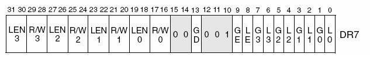
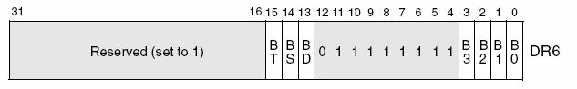

# Eh ! Hook moi ça ! #
Nous allons aborder dans cette article une manière de hooking dans le kernel-land qui à le mérite de ne pas touche directement le code de la fonction cible (comme le inline-hook ou le hot patching) et qui n’est pas facile à désactiver, je ne vais pas dire en plus … je vous laisse le soin de lire l’article.  

Cette manière n’est pas une de mes inventions, elle a été proposé sur rootkit.com par une personne d’origine chinoise dont les explications ne m’était pas décryptable c’est pour cela que j’ai décidé de faire un article sur le fonctionnement de cette technique.  

Beaucoup de personnes disent « ah ca ! J’ai compris … » mais ne vont pas plus loin. Je ne suis pas de ces personnes car toute technique a sa futilité et comprendre le pourquoi de chaque instruction du code est indispensable selon mon point de vue.

Je vais commencer par détaillez de la façon la plus simple possible le fonctionnement des registres de debug.  

## 1. Les registres de debug (DRx) ##
Pour commencer il faut savoir qu’il existe deux vecteurs d’interruptions pour gérer les exceptions du au débogage : le vecteur 1 qui gère les exceptions de type #DB (debug exception) comme les nomme les inteliens (w00t de nom xD) et le vecteur qui gère les exceptions de type #BP (breakpoint exception).  

Généralement les exceptions de type #DB (c’est celle dont je parlerai tout au long de l’article) sont générées par les options activés dans les registres de débogages et les exceptions de type #BP sont générées par l’interruption 3.  

Les registres de debug sont au nombre de 8, noté de DR0 à DR7.  

Les registres DR0, DR1, DR2, DR3 sont là pour contenir les adresses virtuelles des points d’arrêts souhaites.  

Les registres DR4, DR5 eux sont utilisé seulement dans le cas où l’option de l’extension du débogage est activée.  
Nous ne ferons donc pas référence à l’option et à ces registres dans cet article.  

Le registre DR6 est le registre qui nous permettra de connaitre l’état de la dernière exception de débogage généré.  

Enfin le registre DR7 est le registre qui permet d’activer les breakpoints ou non avec plus ou moins d’options.  

Donc comme vous avez pu le comprendre les registres DR6 et DR7 sont assez importants c’est pour cela que je vais détailler leurs compositions mais je commencerai par le registre DR7 pour la logique des informations.



*L0…L3* : Ce bits permettent d’activer la génération d’une exception lorsque les conditions pour nos 4 breakpoints possibles mais tout ceci dans la tâche courante.  
Ces bits sont donc clear à chaque changement de tâche.  

*G0…G3* : Ces bits sont semblables à ceux d’avant mais ceux ci ont une portée globale et donc sont actifs pour toutes les tâches (Breakpoint Global). 

*LE et GE* : Ces bits activent la détection de l’instruction qui à généré l’exception en cas d’exception de type lecture/écriture de donnée. Intel conseille de les mettre à 1 pour une compatibilité envers tous les processeurs.  

*GD* : Celui ci permet en quelque sorte d’activer une protection des registres DRx.  
S’il est activé une exception prioritaire est générée si une instruction MOV tente un accès sur les registres DRx.
Ce qui est important est primordial de savoir c’est que ce bit est clear à chaque appel d’une exception de débogage pour permettre au gestionnaire de l’exception de modifier les DRx et si voulu de réactivé la protection.

*R/W0…R/W3* : Ces bits permettent de configurer les conditions d’accès pour qu’une exception soit générée :  
* 00 -> Une exception est générée seulement lors de l’exécution d’une instruction  
* 01 -> Lors d’une lecture de donnée  
* 10 -> Lors de lecture/écriture sur un port  
* 11 -> Lors d’une lecture/écriture de donnée  

*LEN0…LEN3* : Eux aussi permettent de configurer une option. Ils indiquent la taille des blocs pointés par les registres DR0…DR3  
* 00 -> un octet  
* 01 -> deux octets  
* 10 -> indéfini  
* 11 -> quatre octets  

Intel nous indique de mettre à 00 ces bits si le breakpoint est seulement a l’exécution de l’instruction pointé.

Enfin les messieurs de chez Intel nous informe que le registre DR6 n’est jamais remis a zéro par le processeur et cela nous indique donc que la routine de gestion des #DB doit mettre a 0 le DR6 pour identifier clairement la prochaine exception.

Passons au registre DR6 qui lui nous donne l’état de la dernière exception de débogage généré je le rappel.



*B0…B3 :* Ces bits signalent quel breakpoint à généré la dernière exception. (B0 pour DR0 etc…)  

*BD :* Ce bit concerne la protection activé par le bit GD du registre DR7 (voila pourquoi entre autre j’ai commencé par les explications du registre DR7)  
Il signale donc que l’exception à été généré avant l’exécution d’une instruction MOV qui demanda l’accès aux registres DRx.  

*BS :* Ce bit indique que l’exception à été généré par le mode pas-à-pas du processeur activable par le bit TF dans le registre EFLAGS.  

*BT :* Enfin ce dernier bit informe que la dernière exception provient d’un changement de tache. Cette demande d’exception lors d’un changement de tache est activable par le TSS de la tache cible.  

Voila tout ce que vous devez savoir (voir plus …) pour comprendre la suite de cet article. Si vous voulez en savoir plus de ces magnifiques registres je vous laisse le soin de lire le chapitre 15.2 voir tout le chapitre 15 du Volume 3 des manuels d’Intel [LIEN].

## 2. A l’attaque ! ##
Le principe de la technique est assez simple : mettre un breakpoint au début de l’API cible puis lors de la routine de gestion de l’exception, il nous reste qu’à modifier l’adresse de retour.  

Nous devrons donc modifier aussi la routine de gestion de l’exception. Je vous conseille de vous rendre dans mon article précédent si vous n’avez pas idée de comment hooker une routine de gestion d’exception.  

### Qu’est ce que nous devons faire ? ###

1. Tout d’abord remplacer la routine par la notre
2. Ensuite paramétrer notre breakpoint

### Comment remplacer la routine ? ###

J’ai déjà détaillé le hook de routine de gestion d’exception dans mon article précédent (De la réalité a la virtualité … 1/2) donc je vous laisse relire la partie traitant de la technique utilisé.

HookInt(0×01, (unsigned long)NewInt01, &OldDebugExceptionHandler);

### Comment paramétrer notre breakpoint ? ###
```assembly
	mov eax, ZwCreateFile;
	mov dr0, eax;
 
	mov eax, dr7;
	or  eax, 0x2202;
	and eax, 0xfff0ffff;
	mov dr7, eax;
```
Dr0 => Adresse de l’instruction  

Dr7 => G0 = 1; GE = 1; GD = 1; R/W0 = 00; LEN0 = 00

### Qu’est ce que doit faire notre routine ? ### 

Les cas possibles :  
* L’exception à été généré par la protection des registres DRx.
* L’exception a été générée par notre breakpoint.
* Sinon l’exception ne nous concerne pas.

### Comment reconnaitre simplement ces cas ? ### 
* L’exception à été généré par la protection des registres DRx : Le bit BD sera à 1 dans ce cas la.
* L’exception a été générée par notre breakpoint : Le bit B0…B3 (celui correspondant à notre breakpoint) sera à 1 dans ce cas.
* Donc le reste est à redirigé sur l’ancienne routine.  

Voila un squelette possible en assembleur …
```assembly
	push eax;
	mov eax, dr6;
 
	test eax, 0x2000;
	jz Is_Breakpoint;
 
	; Cas d'exception généré par la protection des registres DRx ...
 
Is_Breakpoint:
	test eax, 0x1;
	jz Is_Other;
 
	; Cas d'exception généré par notre breakpoint ( DR0 ) ...
 
Is_Other:
 
	; Cas d'exception ne nous concernant pas ...
```
### Qu’est ce que nous devons faire une fois ces cas reconnus ? ###

L’exception à été généré par la protection des registres DRx : 

Comme dit précédemment, en entrant dans la routine de gestion des exceptions de débogage, la protection est désactivée.
Donc le seul moyen de la désactiver (oui il faudra bien un jour la desactiver …) est de ne pas la réactiver a chaque passage … yykingking (Wtf ?) a choisi de tester un booléen pour savoir si il faut le réactiver.

Donc il accède volontairement a un registre de débogage pour déclencher une exception et dans sa routine il teste le booléen qu’il a préalablement mis a true pour lui indiquer de ne pas réactiver la protection.

C’est un point assez tordu à comprendre mais il n’y a pas d’autre moyen pour faire ca …

L’exception a été générée par notre breakpoint :

Enfin ! Nous allons parler de ce qui est le principal sujet de cet article : le hooking. Donc en ce point la de la routine, nous savons que la prochaines instruction dans le processus courant est l’instruction pointé par notre breakpoint.
Nous nous trouvons donc dans la fonction que nous souhaitons hooker … L’astuce qui est utiliser pour exploiter certaines vulnérabilités est de tout simplement modifier l’adresse de retour de notre routine se trouvant sur la pile.

Ainsi lors de notre iretd, nous pouvons nous trouver ou nous voulons …

Dans les autres cas, un petit jump sur l’ancienne routine est suffisant.

Voila la routine finale …
```assembly
	push eax;
	mov eax, dr6;
 
	test eax, 0x2000;
	jz Is_Breakpoint;
 
	xor eax,eax;
	mov dr6, eax;
 
	cmp bExit, 0;
	jnz End;
 
	mov eax, [esp + 4];
	add eax, 3;
	mov [esp + 4], eax;
 
	jmp Enable_GD;
 
Is_Breakpoint:
	test eax, 0x1;
	jz Is_Other;
 
	xor eax,eax;
	mov dr6, eax;
 
	mov eax, NewZwCreateFile;
	mov [esp + 4],eax;
 
Enable_GD:
	mov eax, dr7;
	or  eax, 0x2000;
	mov dr7, eax;
 
End:
	pop eax;
	iretd;
 
Is_Other:
 
	pop eax;
	jmp OldDebugExceptionHandler;
```

Une petite chose qui peut paraitre anodine et louche mais qui a son importance … add eax, 3;

A cette instruction, nous somme dans le cas où l’exception à été généré par la protection GD mais nous n’avons pas demandé de la désactiver. Or si nous la réactivons mais que nous retournons sur l’instruction qui tentai l’accès a un registre DRx, ca recommencera sans fin … En étudiant les instructions possibles pour avoir accès a ces registres nous trouvons qu’elles sont toutes constitué d’un opcode de 2 octets + 1 octet pour le ModR/M. C’est pour cela que nous ajoutons 3 à l’adresse de retour.

### Et comment on fait pour arrêter ? ###

Première chose à faire, désactiver la protection GD pour cela il suffit donc comme dit précédemment de mettre notre booléen global a 1 et délibérément générer une exception par accès a un registre DRx.
Ensuite désactivé notre breakpoint pour enfin remettre l’ancienne routine.

```assembly
	bExit = 1;
 
	__asm
	{
		xor eax, eax;
		mov dr0, eax;
 
		mov eax, dr7;
		and eax, 0xfffffffc;
		mov dr7, eax;
	}
 
	DeHookInt(0x01 , OldDebugExceptionHandler);
```

Voila il nous manque plus que notre nouvelle partie de l’API hooké. Je prendrai la même API cible que l’exemple de rootkit et la même fonction de vérification de hook soit :

```assembly
void PrintHook()
{
	DbgPrint(" Now Get In ZwCreateFile Hook: Pid: %d...\n", (ULONG)PsGetCurrentProcessId());
}
 
void __declspec( naked ) NewZwCreateFile()
{
	__asm
	{
		call PrintHook;
		mov eax,0x25;
		jmp OldZwCreateFile;
	}
}
```

Pourquoi faire un mov eax, 0×25; ?

Cette instruction est tout simplement la première instruction présente dans ZwCreateFile (pour les plus curieux, 0×25 correspond a un index dans une table nommé SSDT, cette table est utilisé par l’instruction sysenter pour savoir où il doit se rediriger … google.fr pour la suite), qui est notre API cible dans l’exemple. Et les raisons sont semblables a celles du pourquoi de l’instruction add eax,3;

OldZwCreateFile à été préalablement sauvegarder de cette façon : OldZwCreateFile = (ULONG)ZwCreateFile + 5;

Alors vous avez compris ? Non ? (Pitoyable … :smirk: Si à la fin de notre fonction NewZwCreateFile, nous retournons sur ZwCreateFile nous allons une fois de plus générer une exception … donc on simule la première instruction de l’API ciblé dans notre fonction puis nous la sautons … (mov eax, 0×25; => 5 octets)

Voila ! Cette technique n’a plus aucun secret pour vous désormais… Vous pouvez maintenant essayer de décrypter les commentaires en chinois sur l’article de rootkit  :smile:

Le code est disponible [ici](ici). 

__*References*:__  
Intel _Volume2A_Instruction Set Reference.pdf  
Intel _Volume3_System Programming Guide.pdf  
http://rootkit.com/newsread.php?newsid=738  